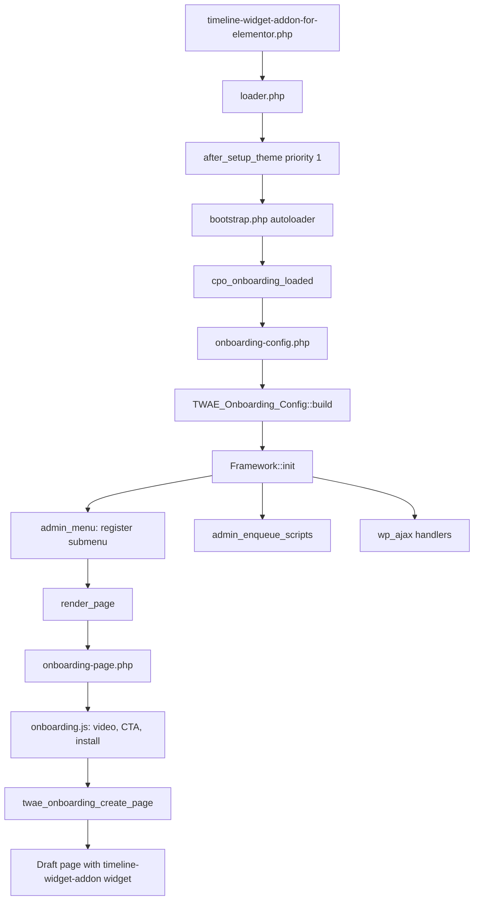

# Cool Plugins Onboarding Framework

Timeline Widget for Elementor uses the shared **cp-onboarding** framework for its
Getting Started screen: a single-method flow (no editor chooser), video + setup
steps, Pro cross-sell, and a one-click **Create Sample Timeline** action that
opens a pre-filled Elementor draft page.

No Composer. No build step. WordPress.org friendly.

## Folder structure

```
cp-onboarding/
├── loader.php                      # versioned loader (bundled identically everywhere)
├── onboarding-config.php           # TWAE wiring, demo page logic, menu fallbacks
└── framework/
    ├── bootstrap.php               # autoloader for CoolPlugins\Onboarding namespace
    ├── src/
    │   ├── class-config.php        # per-plugin config wrapper + edition/tier gating
    │   ├── class-framework.php     # menu, assets, AJAX (all prefixed)
    │   ├── class-telemetry.php     # per-plugin counters in wp_options
    │   └── class-addons.php        # cross-sell card state (cached get_plugins)
    ├── views/
    │   └── onboarding-page.php     # data-driven template (loops over methods)
    └── assets/
        ├── onboarding.css          # shared, cpo- prefixed, colors via CSS vars
        └── onboarding.js           # shared, reads per-plugin localized global
```

**Shared framework** (`framework/`) — identical across Cool Plugins products; do not
edit per plugin.

**Plugin-specific** — all TWAE behaviour lives in `onboarding-config.php` (config
class, Elementor demo page helpers, menu fallbacks, custom AJAX).

## Install (this plugin)

In `timeline-widget-addon-for-elementor.php`:

```php
require_once TWAE_PRO_PATH . 'admin/cp-onboarding/loader.php';
cpo_onboarding_register( '1.1.1', TWAE_PRO_PATH . 'admin/cp-onboarding' );

add_action( 'cpo_onboarding_loaded', function () {
    require TWAE_PRO_PATH . '/admin/cp-onboarding/onboarding-config.php';
} );
```

`onboarding-config.php` then:

1. Builds the config via `TWAE_Onboarding_Config::build()`.
2. Wraps it in `new Config( $config_array )`.
3. Instantiates `Framework` and calls `init()`.
4. Registers TWAE-specific filters, AJAX handlers, and menu fallbacks.

## How TWAE uses the framework

Unlike Cool Timeline (multi-method chooser), TWAE is a **single-method** flow:

| Setting | Value | Effect |
|---------|-------|--------|
| `show_chooser` | `false` | No method tabs — video + steps render directly |
| `methods` | one `widget` entry | Elementor widget setup guide |
| `edition` | `full` | Full onboarding UI (liter would strip edition-gated methods) |
| `tier` | `free` | Pro upsell via addon cards and footer links |
| `prefix` / `slug` | `twae` | Page slug: `twdivi-getting-started` |

Plugin-specific demo logic is **not** a separate class file. Elementor page
creation lives at the bottom of `onboarding-config.php`
(`twae_onboarding_create_timeline_page`, `twae_onboarding_build_timeline_data`, etc.).

## Request & render flow



1. **Loader** — Registers this copy at version `1.1.1`; highest version across
   active plugins wins (see below).
2. **Config** — Reads telemetry and `$_GET['mode']`, builds identity + one method +
   addons + footer.
3. **Framework** — Registers submenu, enqueues `onboarding.css` / `onboarding.js`
   on `twdivi-getting-started`, localizes `twaeOnboardingData`.
4. **View** — Renders header, video, numbered steps, CTA bar, Pro addon card
   (dashboard only), and footer cards.
5. **Create CTA** — JS calls `twae_onboarding_create_page` (not the default
   `twae_onboarding_prepare`), which creates or reuses an Elementor draft and
   redirects to the Elementor editor.

## Admin menu placement

Where **Getting Started** appears depends on what else is active:

| Scenario | `parent_slug` | Visible under |
|----------|---------------|---------------|
| Cool Timeline active | `''` (empty) | Orphan page — linked from CTL dashboard / plugin links; URL `admin.php?page=twdivi-getting-started` |
| TWAE standalone (no CTL) | `cool-plugins-timeline-addon` | Settings → Timeline Addons (redirects to Getting Started); submenu row hidden via CSS |
| No Timeline Addons menu at all | Fallback in `onboarding-config.php` | Elementor → Getting Started (`admin_menu` priority 25) |

When Cool Timeline is active, `onboarding-config.php` also sets `$title` on
`admin_init` so orphan pages do not pass `null` to `strip_tags()` in
`admin-header.php`.

## Screen modes

| Mode | URL | Behaviour |
|------|-----|-----------|
| `onboarding` | `admin.php?page=twdivi-getting-started&mode=onboarding` | First-run flow after activation; footer shows Pro upgrade card instead of review |
| `dashboard` | `admin.php?page=twdivi-getting-started` | Default; Pro addon cross-sell card; footer includes "Leave a Review" |

`TWAE_Onboarding_Config` branches on `$is_onboarding` for UTM params, footer
cards, and whether the Pro addon appears in the bottom section.

### Activation redirect

On **first install only** (`twae_activate` sets `twae_is_new_user` and a short-lived
transient), the user is redirected to the onboarding URL. Reactivations and bulk
activations are skipped.

Any interaction on the Getting Started page clears `twae_is_new_user` (via the
`twae_onboarding_track` hook at priority 5, and when the Create CTA runs).

## How "one fix updates all plugins" works

WordPress.org has no shared libraries, so each plugin bundles its own copy of
this framework. `loader.php` registers each copy with its version; on
`after_setup_theme` (priority 1) only the **highest** version present loads.
When any one plugin ships a newer framework, every other active plugin runs on
it too.

> Always bump the version in `cpo_onboarding_register()` when you change
> framework code. TWAE currently registers `1.1.1`.

## Derived names (prefix collision safety)

All runtime identifiers use `prefix` = `twae`:

| Helper | Example |
|--------|---------|
| `option( 'telemetry' )` | `twae_onboarding_telemetry` |
| `ajax_action( 'prepare' )` | `twae_onboarding_prepare` |
| `ajax_action( 'track' )` | `twae_onboarding_track` |
| `handle()` | `twae-onboarding` |
| `js_global()` | `twaeOnboardingData` |
| Page slug | `twdivi-getting-started` |

## Config keys (TWAE)

### Identity

| Key | TWAE value |
|-----|------------|
| `slug` / `prefix` | `twae` |
| `text_domain` | `timeline-widget-addon-for-elementor` |
| `plugin_dir` / `plugin_url` | `TWAE_PRO_PATH` / `TWAE_PRO_URL` (plugin root — framework appends `admin/cp-onboarding/framework/assets/`) |
| `parent_slug` | `''` if Cool Timeline active, else `cool-plugins-timeline-addon` |
| `show_chooser` | `false` |
| `only_new_user` | `true` (paired with `twae_is_new_user` in main plugin) |
| `colors.primary` | `#2e9e9d` |

### Single method (`widget`)

| Key | Purpose |
|-----|---------|
| `type` | `elementor-based` — sent to telemetry and AJAX |
| `video` | YouTube ID `mau6jLJZY1s` with inline player |
| `steps` | Three numbered setup steps |
| `cta` | `Create Sample Timeline` — hidden after `cta_clicked.widget-based` telemetry > 0 |
| `secondary` | View Demo → cooltimeline.com |
| `redirect_url` / `fallback_url` | Pages list (static fallback if AJAX fails) |

### Addons

Dashboard mode only (not onboarding): one **Pro** card for Timeline Widget Pro
(`type` => `pro`, external `upgrade_url`). Free Cool Timeline cross-sell is
commented out in config.

### Footer (`links.footer`)

Three cards: Support, Documentation (doc links with UTM), and either Review
(dashboard) or Upgrade to Pro (onboarding).

## AJAX endpoints

### Framework (prefixed)

| Action | Purpose |
|--------|---------|
| `twae_onboarding_track` | Telemetry (`method_picked`, `cta_clicked`, `video_played`, etc.) |
| `twae_onboarding_install` | Install/activate addons (allow-list from config) |
| `twae_onboarding_prepare` | Default framework handler (not used for Create — see override) |

### TWAE override: `twae_onboarding_create_page`

Registered in `onboarding-config.php`. The `twae_onboarding_script_data` filter
sets `data.action` to this handler instead of `twae_onboarding_prepare`.

**Flow:**

1. Verify nonce + `manage_options`.
2. Clear `twae_is_new_user`.
3. Reuse `twae_onboarding_demo_page_id` if the draft still exists, is not trashed,
   and still contains `timeline-widget-addon` in `_elementor_data`.
4. Otherwise create a new draft page titled "My Timeline" with:
   - `_elementor_edit_mode` = `builder`
   - `_elementor_data` = section → column → `timeline-widget-addon` widget
   - Three pre-filled sample stories (images from plugin assets)
5. Return `redirectUrl` → Elementor editor (`post.php?post={id}&action=elementor`).

**Filters:**

| Filter | Purpose |
|--------|---------|
| `twae_onboarding_force_new_page` | Force a fresh draft even if a valid one exists |

**Options:**

| Option | Purpose |
|--------|---------|
| `twae_onboarding_demo_page_id` | ID of the reusable demo draft (non-autoloaded) |

## Shared framework reference

For the full config schema (all method/addon keys, edition/tier gating, filters,
and security notes), see the same framework classes in `framework/src/` or the
Cool Timeline copy at `cool-timeline/admin/cp-onboarding/README.md`.

### Edition / tier (when relevant)

- `'editions' => array( 'full' )` on the widget method — hidden in liter builds.
- `'tier' => 'pro'` on a method — locked upsell card in free builds (not used on
  TWAE's single free method today).
- Pro promotion is handled via addon cards and footer links instead.

## i18n

The framework owns no text domain. All visible strings are passed in via config
(already translated with `timeline-widget-addon-for-elementor`), or via:

- `twae_onboarding_labels` — JS loading / redirect / error strings
- `twae_onboarding_script_data` — localized JS object (swaps AJAX action, install labels)

## Filters (TWAE)

| Filter | Purpose |
|--------|---------|
| `twae_onboarding_labels` | Override CTA loading messages |
| `twae_onboarding_script_data` | Point Create button at `twae_onboarding_create_page` |
| `twae_onboarding_force_new_page` | Skip demo page reuse |
| `twae_onboarding_body_{mode}` | Replace entire page body for a mode (framework hook) |

## Security & performance

- All AJAX handlers verify a prefixed nonce and `manage_options`.
- Addon install uses a slug allow-list from config; never trusts the request alone.
- All output is escaped in the view; demo page meta is built server-side.
- Telemetry option (`twae_onboarding_telemetry`) is non-autoloaded, capped at 50 keys.
- `get_plugins()` is cached once per request in `Addons`.
- Telemetry uses `navigator.sendBeacon` so events survive redirects after Create.
- Elementor `_elementor_data` is stored with `wp_slash( wp_json_encode( ... ) )`
  to match WordPress unslash behaviour on insert.

## Related files outside `cp-onboarding/`

| File | Role |
|------|------|
| `timeline-widget-addon-for-elementor.php` | Loader registration, activation redirect, Timeline Addons menu (standalone) |
| `admin/twae-timeline-header.php` | Global header on Getting Started (hidden in `mode=onboarding`) |
